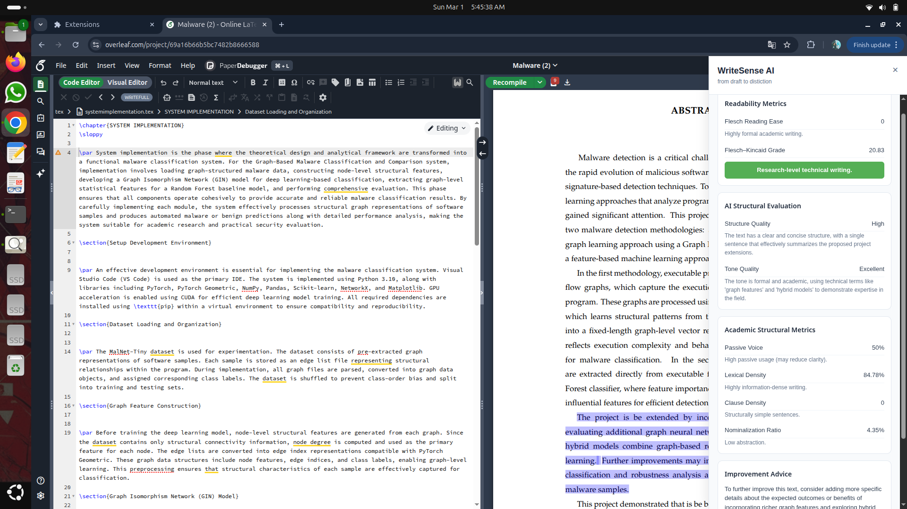
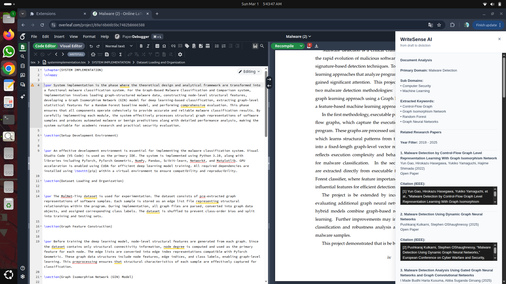

# WriteSense AI

<div align="center">

### AI-Powered Academic Writing Assistant for Overleaf

**Privacy-Focused • FastAPI • Chrome Extension • LanguageTool • LLaMA 3 • NLP**

---


</div>

---

# 📖 Overview

**WriteSense AI** is a privacy-focused AI-powered academic writing assistant developed for **Overleaf**. It helps researchers, students, and academic writers improve the quality of their LaTeX documents using local AI models while preserving formatting, citations, and technical terms.

Unlike cloud-based writing assistants, WriteSense AI performs processing locally, ensuring better privacy and faster response times.

---

# ✨ Features

- ✅ Grammar Correction
- ✅ Academic Clarity Analysis
- ✅ AI-powered Writing Suggestions
- ✅ Research Paper Recommendation
- ✅ Text Summarization
- ✅ Translation
- ✅ LaTeX-safe Editing
- ✅ Local AI Processing using Ollama
- ✅ Rule-based Grammar Checking using LanguageTool

---

# 🏗 System Architecture

```
                           +-----------------------+
                           |   Chrome Extension    |
                           |   (Overleaf Client)   |
                           +-----------+-----------+
                                       |
                                       ▼
                          +------------------------+
                          |     FastAPI Gateway    |
                          +-----------+------------+
                                      |
      -----------------------------------------------------------------------
      |              |              |               |                      |
      ▼              ▼              ▼               ▼                      ▼
+-------------+ +-------------+ +-------------+ +-------------+ +----------------+
| Grammar API | | Clarity API | | Research API| | Summary API | | Translation API|
+------+------+ +------+------+ +------+------+ +------+------+ +--------+-------+
       |               |               |               |                    |
       ▼               ▼               ▼               ▼                    ▼
 LanguageTool      Ollama LLaMA3    CrossRef API    Ollama LLaMA3    NLLB-200 Model
 (Grammar Rules)   (Clarity AI)     + LLaMA3        (Summarizer)     (Multilingual)
       |               |               |               |                    |
       ----------------------------------------------------------------------
                                      |
                                      ▼
                      Academic Writing Enhancement Results
```

---

# 🛠 Technology Stack

## Frontend

- HTML5
- CSS3
- JavaScript (ES6)
- Chrome Extension API

---

## Backend

- Python 3
- FastAPI
- Uvicorn

---

## AI & NLP

- Ollama
- LLaMA 3
- LanguageTool
- NLLB-200 (Multilingual Translation)
- CrossRef API
- Regular Expressions (Regex)

---

## Machine Learning / NLP Models

- LLaMA 3
- facebook/nllb-200-distilled-600M

---

## Libraries

- Transformers (Hugging Face)
- Requests
- PyTorch
- Python Standard Library

---

## Development Tools

- Git
- GitHub
- Visual Studio Code
- Ubuntu Linux

---

## Supported Features

- Grammar Correction
- Academic Clarity Analysis
- Research Paper Recommendation
- Text Summarization
- Multilingual Translation
- Chrome Extension Integration
- Local AI Inference
- LaTeX-safe Processing
---

# 📂 Project Structure

```
Latex-Writesensi-AI
│
├── grammar_backend
├── clarity_backend
├── research_backend
├── summarization
├── translation_backend
│
├── screenshots
│
├── docs
│
├── requirements.txt
├── README.md
└── app.py
```

---

# 📸 Screenshots

## Home


---

## Grammar Correction


---

## Clarity Analysis



---

## Research Recommendation



---

## Summarization


---

## Translation


---

# 📄 Documentation

Project Report

📄 **WriteSense AI Report**

Place your report inside:

```
docs/
    WriteSense_AI_Report.pdf
```

---

# ⚙ Installation

## Clone Repository

```bash
git clone https://github.com/shivada-2707/Latex-Writesensi-AI.git
```

## Navigate

```bash
cd Latex-Writesensi-AI
```

## Install Requirements

```bash
pip install -r requirements.txt
```

## Run Backend

```bash
python app.py
```

---

# 🚀 Future Enhancements

- Voice-based Academic Assistant
- Citation Recommendation
- AI Literature Survey
- Plagiarism Detection
- Multi-language Academic Support
- Cloud Synchronization
- Personalized Writing Analytics

---

# 🎯 Project Objectives

- Improve academic writing quality.
- Preserve LaTeX formatting.
- Provide AI-assisted writing support.
- Ensure privacy using local AI models.
- Assist researchers during paper preparation.

---

# 👩‍💻 Author

**Shivada Manoj**

MCA Graduate

Government Engineering College Thrissur

GitHub: https://github.com/shivada-2707

---

# ⭐ Support

If you found this project useful, consider giving it a ⭐ on GitHub.

---

## 📜 License

This project is intended for educational and research purposes.
